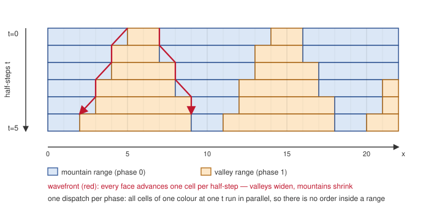

Metal engine
============

``openEMS model.xml --engine=metal`` runs the FDTD field updates on Apple GPUs
via Metal. Build with ``-DWITH_METAL=ON``; the option is off by default. It
enables every Metal feature; there are no per-feature switches. The same binary
keeps the SSE and multithreaded engines for comparison.

Operator construction, mesh grading, material EC sampling and the coefficient
build stay on the CPU. The GPU also executes the PEC / ``MATERIAL|METAL``
geometry pass; its winners remain available to the conducting-sheet and
dispersive-material setup code.

Field updates
-------------

The GPU advances an in-place space-time diamond wavefront over one E/H field
pair; no full-grid ping-pong copy is allocated. Each axis is split into
alternating mountain and valley ranges whose faces advance by one cell per E/H
half-step. Their Cartesian product gives four independent phases.

patch.

   One axis of the diamond schedule. Mountains contract and valleys widen by
   one cell per half-step, so the two faces of every valley *are* the advancing
   wavefront (red). All cells of one colour at one half-step belong to a single
   dispatch and run in parallel: **there is no compute order inside a range.**
   The only orders are the half-step sequence and the phase sequence. The four
   real phases are the Cartesian product of this picture over the X and Y axes.

Every threadgroup owns one XY diamond, spans all packed-Z slots, and advances
up to four timesteps in place. Mountains within a phase are independent, and so
are valleys; the host issues one dispatch per phase, so Metal itself provides
the barrier between them. Inside a tile, threadgroup barriers order E, voltage
source, H and current source. No grid-wide spin barrier is used.

The shortest XY span is two cells, which keeps enough threadgroups for large
grids. Depths one through four are precomputed, so a partial final block stays
on the same path.

Sources are assigned to their owning tile for each local timestep. Ordering,
overlapping sources, packed-Z lanes, partial edge tiles and boundary values are
bit-identical to the explicit two-dispatch Metal path.

UPML, ADE and arbitrary CPU extension hooks have not migrated inside the
wavefront; a normal Metal run needing them aborts before timestep 0. Fast math
is always off.

PEC and geometry mapping
------------------------

The Metal pass resolves the winning ``MATERIAL|METAL`` primitive per Yee
component and records it via ``Operator::GetGeometryWinners()``;
``Operator_Ext_ConductingSheet`` and ``Operator_Ext_LorentzMaterial`` consume
those winners instead of re-querying CSXCAD per cell. Unsupported primitives and
genuine near-boundary ties fall back to the original CPU query, so no
approximate decision is used at an edge.

Supported primitives (untransformed, Cartesian only):

* ``BOX`` (Cartesian box)
* ``POLYGON``
* ``LINPOLY`` (linearly extruded polygon)
* ``CYLINDER``
* ``CYLINDRICALSHELL`` (via-like annuli)

Unsupported primitives, resolved per query via CSXCAD FP64:

* ``POINT``, ``MULTIBOX``
* ``SPHERE``, ``SPHERICALSHELL``
* ``ROTPOLY``, ``POLYHEDRON``, ``POLYHEDRONREADER``
* ``CURVE``, ``WIRE``, ``USERDEFINED``
* any primitive with a transform, a non-Cartesian input coordinate type, or a
  cylindrical coordinate system

Further behaviour:

* Yee coordinates and inclusive index ranges are computed in CPU FP64; polygon
  interiors use the CSXCAD winding rule with exact ``orient2d`` sign
  (double-float coordinates), with a conservative fallback band near the
  decision boundary.
* Unsupported primitives make only the affected queries use the CSXCAD path;
  they are never silently dropped, and can remove most of the speedup for such
  geometries.
* The conducting-sheet extension keeps per-cell sheet state (``sigma``,
  thickness, tangent direction) only for resolved sheet cells instead of three
  full-grid lookup tables (~19 GB on a 696M-cell model).

UPML
----

UPML has not migrated into the diamond wavefront and runs only under the
explicit legacy diagnostic path, never selected automatically. Its indexed
layout permutes coefficients and fluxes into packed-field order. Operator
coefficient arrays are permuted in place and restored on teardown, and lossless
32-bit dictionaries rebuild the dense CPU arrays for later CPU engines.

Coefficient dictionaries
------------------------

The engine deduplicates each packed position's 48 FP32 values (VV, VI, II, IV ×
three components × four lanes) by exact 32-bit pattern, with a shared ``uint16``
index buffer. This reduces the GPU coefficient working set, **not** total process
RAM; index and dictionary copies happen only at initialization. Construction
falls back to dense reads when unique records exceed ``min(65536, positions/4)``
(the packed ``uint16`` index limit). Very nonuniform meshes can hit the limit and
retain dense reads automatically; initialization reports which path was taken.
Coefficients must remain immutable during stepping.

Conducting-sheet ADE
--------------------

The conducting-sheet model advances two ADE poles per active edge every step.
The Metal engine runs that recurrence in two kernels: ``ade_advance`` before the
voltage update and ``ade_apply`` from ``Apply2Voltages`` after it. One thread
owns all poles of one packed field edge, so the apply is race-free and matches
the CPU subtraction order. Previously the recurrence ran on the CPU and the
engine drained the GPU before each hook, serializing CPU and GPU.

Only the explicit legacy diagnostic path currently runs the plain volt-ADE
offload. ADE has not yet migrated into the diamond wavefront; a default Metal
run requiring ADE aborts before stepping. Models needing Lorentz flux states or ADE
currents (Lorentz, Drude, Debye) likewise require explicit legacy diagnostics.

Diagnostic overrides
--------------------

Three variables select alternative paths, and one enables a diagnostic. All
default to the primary path and are never required.

.. list-table::
   :header-rows: 1
   :widths: 42 58

   * - Variable
     - Effect
   * - ``OPENEMS_METAL_PEC=0`` or ``verify``
     - whole PEC pass on the CPU, or GPU plus CPU comparison
   * - ``OPENEMS_METAL_PML=0``
     - CPU UPML conditioning instead of the GPU kernels
   * - ``OPENEMS_METAL_FUSED_PIPELINE=0``
     - explicitly selects the legacy two-dispatch path (UPML, ADE)
   * - ``OPENEMS_METAL_FP64_REFERENCE=1``
     - legacy path plus a diagnostic CPU FP64 update reference

Validation
----------

.. code-block:: sh

   python macos/tests/metal_fields.py --openems /absolute/path/to/openEMS --suite
   python macos/tests/metal_pec.py --openems /absolute/path/to/openEMS
   python macos/tests/metal_conductingsheet.py --openems /absolute/path/to/openEMS
   python macos/tests/metal_dispersive.py --openems /absolute/path/to/openEMS
   OPENEMS_METAL_FUSED_PIPELINE=0 python macos/tests/metal_ade.py --openems /absolute/path/to/openEMS
   OPENEMS_METAL_FUSED_PIPELINE=0 python macos/tests/metal_pml.py --openems /absolute/path/to/openEMS

``metal_fields.py`` compares SSE against Metal with relative-L2 limits and
requires dense/compressed and diamond/explicit-legacy variants to be
bit-identical. ``--stress-sources`` adds overlapping sources spanning tile
boundaries. The PEC, conducting-sheet and dispersive suites compare CPU vs GPU
winner resolution and require bit-identical dumps. ``metal_ade.py`` compares the
GPU conducting-sheet ADE against the SSE CPU recurrence.

A separate performance harness lives in ``macos/bench/`` and is documented in
``macos/doc/metal-benchmark.rst``.

Limitations and fallbacks
-------------------------

The CPU stays the geometry authority wherever a GPU predicate would be
approximate: those affected PEC queries run through CSXCAD FP64 and are never
silently dropped. A normal Metal run either constructs the in-place diamond
kernel or aborts before timestep 0; it never substitutes the legacy E/H update
or a CPU extension path automatically.

Platform and coordinate systems
~~~~~~~~~~~~~~~~~~~~~~~~~~~~~~~

* Cartesian meshes only. For a cylindrical mesh ``SetupOperator()`` selects the
  cylindrical operator regardless of ``--engine``, so ``--engine=metal`` is
  ignored with a warning.
* MPI is not supported (``Operator_Metal`` is not an MPI operator).

The index format has a very high ceiling
~~~~~~~~~~~~~~~~~~~~~~~~~~~~~~~~~~~~~~~~

The GPU kernels use 32-bit indices. The diamond field update addresses ``float4``
words, and the legacy indexed UPML, excitation and ADE kernels address scalar
components. The scalar limit is around ``UINT32_MAX / 3`` -- roughly
1.4 billion cells, about 100 GB of field plus coefficient state -- and the
packed field update is good for roughly four times that. A model beyond the
scalar limit is rejected in ``SetupCSXGrid``, before any material or coefficient
work. This guard is not reachable by any measured workload and is documented
only so the abort is not a surprise.

Kernel compilation
~~~~~~~~~~~~~~~~~~

The kernels are compiled once at build time into ``openEMS.metallib``, embedded
in ``libopenEMS`` and loaded with ``newLibraryWithData:``; the runtime never
compiles. Building with ``-DWITH_METAL=ON`` therefore needs the optional Metal
toolchain component, installed once with:

.. code-block:: sh

   xcodebuild -downloadComponent MetalToolchain

A load or pipeline-creation failure aborts. The PEC pass alone catches its own
failure and runs on the CPU. Fast math is off at compile time.

Geometry fallbacks and explicit legacy diagnostics
~~~~~~~~~~~~~~~~~~~~~~~~~~~~~~~~~~~~~~~~~~~~~~~~~~

Geometry fallbacks print what was skipped and why. Field-update incompatibility
aborts unless the user explicitly requested the legacy diagnostic.

.. list-table::
   :header-rows: 1
   :widths: 50 50

   * - Trigger
     - Behaviour
   * - PEC queue/pipeline unavailable
     - whole PEC pass on CPU; field updates still run on the GPU
   * - ``OPENEMS_METAL_PEC=0``, or a non-Cartesian mesh
     - whole PEC pass on CPU
   * - grid lines non-finite, ``|coord| > 1e10``, not sorted, or polygon with
       too many vertices
     - whole PEC pass on CPU
   * - transformed, non-Cartesian or unsupported primitive (see the list above)
     - per-query CPU resolution
   * - degenerated primitive coordinates, or polygon interior ambiguous
       (``orient2d`` sign zero)
     - per-query CPU resolution
   * - more than 65536 unique UPML coefficient records, or UPML buffer
       allocation fails
     - dense UPML coefficients for that region
   * - more than ``min(65536, positions/4)`` unique operator records
     - dense operator coefficients
   * - UPML, ADE, or an arbitrary CPU extension hook in a normal Metal run
     - aborts before timestep 0; these operations have not migrated inside the
       diamond wavefront
   * - ``OPENEMS_METAL_FUSED_PIPELINE=0``
     - explicitly runs the legacy two-dispatch diagnostic path
   * - ``OPENEMS_METAL_FP64_REFERENCE=1``
     - explicitly selects the legacy path plus diagnostic CPU reference

Geometry fallbacks are per query: one unsupported primitive does not disable the
whole pass, but such geometry (and the near-boundary band) can remove most of
the speedup. When the geometry winners are unavailable (for example with
``OPENEMS_METAL_PEC=0``), the conducting-sheet and dispersive extensions rebuild
their full-grid state tables instead of the sparse per-cell form, which costs
far more memory (about 19 GB on a 696M-cell model).

Accuracy
~~~~~~~~

* SSE and Metal long-run comparison: 3895 E values exceed the default pointwise
  tolerance on the 1000-step cavity case (max abs 7.06e-5). The dense Metal path
  shows the same, so it is not a compression or UPML artifact.
* The FP64 reference is a diagnostic; with UPML it checks local stencils, not
  flux evolution.

Performance
~~~~~~~~~~~

Small or simple geometries are submission-bound and can be slower on the GPU
than on SSE. Regular grids compress exceptionally well; no speedup is claimed
for real PCB models that hit the dense-coefficient fallback. Measured figures
and methodology live in ``macos/doc/metal-benchmark.rst``.
